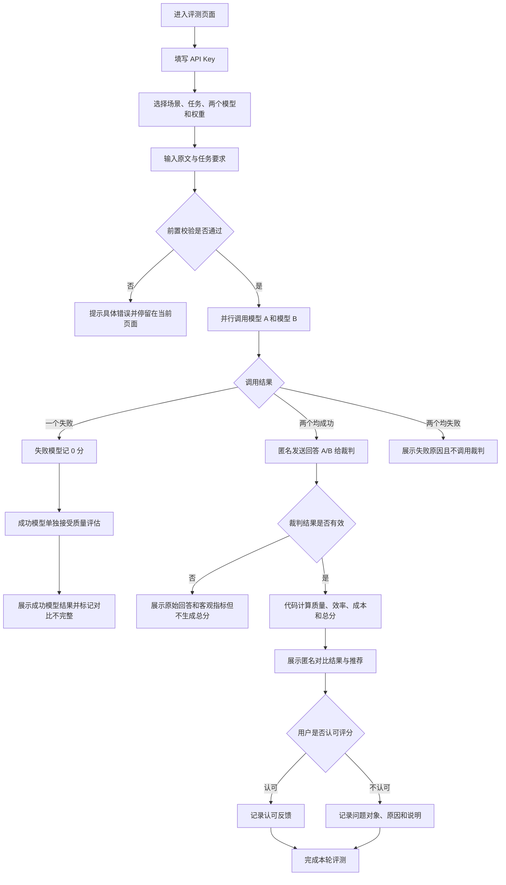

# 大模型评测平台 PRD v0.2

## 1. 文档信息

- 产品名称：大模型评测平台（暂定）
- 产品阶段：MVP
- 使用范围：个人及内部同事使用，暂不上线公开运营
- 产品负责人：用户
- 开发、测试与 AI 应用实现：Codex
- 文档状态：PRD v0.2，核心需求已补齐，待产品负责人进行原型评审

## 2. 背景

产品经理或项目经理在选择大模型时，通常需要分别调用多个模型，再凭主观感受比较结果，难以同时衡量质量、效率和成本。

本产品提供一个轻量级的双模型对比工作台：在统一任务、统一输入和统一运行限制下调用两个模型，记录客观数据，由裁判模型评估回答质量，再依据用户设置的权重计算“业务适配分”，帮助用户完成模型选型。

## 3. 目标用户

- 主要用户：产品经理、项目经理
- MVP 实际用户：产品负责人本人及内部同事

### 3.1 用户故事板

1. **痛点与需求**  
   某产品经理需要在 DeepSeek V4 Pro 和 Kimi K3 之间选择更适合当前项目的模型，但缺少简单、统一的直接对比方式。火山引擎等平台功能较重，而他目前只希望快速了解两个模型在质量、效率和成本上的差异。

2. **发起对比**  
   产品经理选择 DeepSeek V4 Pro 和 Kimi K3，输入相同任务，并根据当前项目目标选择“质量优先”或设置相应权重。

3. **查看结果**  
   系统同时调用两个模型，展示回答、耗时、Token、费用以及裁判模型给出的质量评价和评分依据。

4. **分析与决策**  
   假设本次评测结果为：Kimi K3 的生成质量更高，但速度相对较慢；DeepSeek V4 Pro 的速度更快，但质量稍低。由于当前项目设置为质量优先，系统推荐 Kimi K3。产品经理查看评分依据并人工复核后，确认选用 Kimi K3。

## 4. 产品目标

1. 准确执行既定评测流程，避免漏调模型、模型串位、计分错误和展示错误。
2. 允许用户按业务需要设置质量、效率、成本的权重。
3. 输出透明、可解释的分项分数、综合分数和质量点评。
4. 保证最终结论与用户选择的权重一致。

## 5. 核心原则

- 参评模型使用相同输入、任务要求和参数上限。
- 裁判只看到匿名的“回答 A / 回答 B”，不知道模型名称。
- 质量由裁判模型进行语义判断；效率、成本和总分由代码计算。
- 最终分数代表当前任务与当前权重下的业务适配程度，不代表模型的绝对能力。
- 用户选择“效率优先”时，推荐结论必须以效率权重为准，不能擅自改成“质量更重要”；其他模式同理。

## 6. MVP 范围

### 6.1 支持内容

- 输入模态：文本
- 交互方式：单轮任务
- 场景：办公、法律
- 任务：总结、提取、分类、生成
- 模型对比：每次选择两个模型
- 输入方式：粘贴文本
- 最大输入：1000 字符
- 最大输出：2000 Token
- 超时时间：60 秒
- Temperature：默认 1.0；调用时按模型兼容性处理
- API Key：用户填写 OpenRouter API Key

### 6.2 不做内容

- 图片、音频和视频
- 三个及以上模型同时对比
- 多轮对话
- 文件上传
- 注册、团队协作和权限系统
- 历史记录与报告导出
- 模型微调与自建模型部署
- 代码自动运行、上线测试和自动修改直至完成
- 调用失败后的自动重试

## 7. 候选模型

- DeepSeek V4 Flash
- DeepSeek V4 Pro
- GPT-5.6 Sol
- GPT-5.6 Terra
- GLM-5.2
- Qwen3.7 Max
- Kimi K3
- Grok 4.5
- Claude Sonnet 5
- Claude Opus 4.8

默认裁判模型：DeepSeek V4 Flash。裁判模型在设置中可配置，但不在评分报告中突出展示。

## 8. 用户流程

1. 用户进入全新评测页面。
2. 在设置区填写 OpenRouter API Key。
3. 选择业务场景和任务类型。
4. 在左右回答卡片顶部选择两个参评模型。
5. 选择权重预设，或通过滑块自定义质量、效率、成本权重。
6. 输入原文和任务要求。
7. 点击“开始评测”。
8. 系统并行调用模型 A 和模型 B，并记录耗时、Token 和费用。
9. 系统将原文、任务要求、匿名回答 A/B 发送给裁判模型。
10. 裁判返回结构化质量等级、点评、扣分原因、原文依据和置信度。
11. 代码计算质量分、效率分、成本分和业务适配总分。
12. 页面展示两个模型的回答、原始指标、分项分数、总分、裁判点评和推荐结论。
13. 用户可选择“认可”或“不认可”本轮评分；不认可时补充问题对象、原因和说明，供后续校准。

### 8.1 完整流程与异常分支



补充规则：

- 单个模型失败时，成功模型仍完成质量评估；失败模型为 0 分，页面标注“本轮对比不完整”。
- 两个模型均失败时，不调用裁判，不给出模型能力结论。
- 裁判失败或返回结构错误时，不伪造总分；用户可手动重新发起整轮评测，MVP 不自动重试。
- 用户反馈不直接修改本轮 AI 分数；不认可记录用于后续对比人工判断、调整规则和校准裁判 Prompt。

## 9. 页面结构

采用“左右双栏模型对比工作台”：

- 顶部/侧边设置区：API Key、场景、任务、参数、权重
- 中部左栏：模型 A 选择、回复与运行数据
- 中部右栏：模型 B 选择、回复与运行数据
- 底部输入区：原文、任务要求、开始评测按钮
- 结果区：分项分数、总分、质量点评、证据、推荐结论、人工复核

### 9.1 低保真原型

```text
┌─────────────────────────────────────────────────────────┐
│ 大模型评测平台                         [API Key 设置]    │
├─────────────────────────────────────────────────────────┤
│ 场景 [办公▼]  任务 [总结▼]  评分偏好与权重             │
│ 权重 [均衡] [质量优先] [效率优先] [成本优先] [自定义]   │
│ 质量 40% ━━━━━  效率 30% ━━━  成本 30% ━━━            │
├──────────────────────────┬──────────────────────────────┤
│ 模型A [DeepSeek V4 Pro▼] │ 模型B [Kimi K3▼]            │
│ 状态 / 耗时 / Token /费用│ 状态 / 耗时 / Token /费用    │
│ 回答正文                 │ 回答正文                     │
├──────────────────────────┴──────────────────────────────┤
│ 原文（最多1000字符）                                    │
│ 任务要求                                                 │
│                                         [开始评测]       │
├─────────────────────────────────────────────────────────┤
│ 业务适配分：A 85 / B 78    当前偏好：质量优先           │
│ 质量｜效率｜成本分项；扣分原因；原文证据；推荐理由       │
│                         [认可评分] [不认可并反馈]         │
└─────────────────────────────────────────────────────────┘
```

交互要求：

- 用户界面始终显示所选模型；发送给裁判时，系统在请求内部匿名为回答 A/B。
- 权重切换后立即重新计算总分和推荐，不重新调用模型或裁判。
- 推荐区域必须同时显示“当前权重”和关键推荐依据。
- 错误提示就近展示，不使用只有“请求失败”的模糊提示。

## 10. 评分机制

### 10.1 权重

- 均衡：质量 33.333%、效率 33.333%、成本 33.333%。代码内部按三等份计算，页面总计显示为 100%。
- 质量优先：质量 40%、效率 30%、成本 30%。
- 效率优先：效率 40%、质量 30%、成本 30%。
- 成本优先：成本 40%、质量 30%、效率 30%。
- 自定义：用户通过三个滑块调整，三个维度之和必须为 100%。
- 用户调整任一滑块后，模式自动切换为“自定义”。
- 权重只影响分项折算、总分和推荐，不改变模型原始回答及裁判原始评价。

### 10.2 质量评分

裁判模型内部使用 0—4 档判断：

- 4：完全符合，必要信息完整，基本无错误或编造
- 3：基本符合，仅有轻微遗漏或轻微问题
- 2：部分符合，存在明显错误或重要遗漏
- 1：大部分不符合，结果接近不可用
- 0：未完成、严重编造或完全偏离任务

质量得分：

`质量得分 = 质量档位 ÷ 4 × 质量权重`

“指令模糊”不直接判 0 分；裁判应标记低置信度或建议人工复核。

### 10.2.1 四类任务的质量检查规则

裁判根据任务类型检查以下内容，再给出整体 0—4 档质量判断。

| 任务 | 准确性 | 完整性 | 其他检查 |
| --- | --- | --- | --- |
| 总结 | 所有事实、数字、人物和结论均能在原文找到依据，不改变原意 | 覆盖任务要求中的关键背景、结论、数据、风险和行动项 | 重点清晰、无无关扩写、符合篇幅和格式要求 |
| 提取 | 提取值与原文一致，不猜测缺失字段 | 所有指定字段均有结果；原文没有时明确标记“未提及” | 字段名称、顺序和输出格式符合要求 |
| 分类 | 分类结果属于允许标签，并有原文证据支持 | 对用户要求判断的对象全部完成分类 | 不能自创标签；信息不足时标记不确定，不强行判断 |
| 生成 | 内容符合原文事实和用户约束，逻辑无明显错误 | 覆盖用户要求的必要模块、对象和步骤 | 内容可直接使用，结构清楚，不输出无关内容 |

### 10.2.2 不可接受错误

出现以下情况时必须触发 `needs_human_review`：

- 编造原文不存在的人名、金额、日期、结论、条款或数据。
- 把主体、责任人、权利义务、因果关系或正反结论写反。
- 遗漏足以改变用户决策的核心信息。
- 分类任务输出规定范围外的标签，或漏掉主要分类对象。
- 明确要求某种格式、范围或语言，但输出完全不遵守。

严重编造、核心结论相反或完全偏离任务，质量档位为 0；存在单个关键错误导致结果不可直接使用，最高只能评为 1。

法律场景额外红线：

- 编造法律名称、条款编号、司法结论或合同内容。
- 错置合同主体、金额、期限、违约责任或解除条件。
- 在原文和任务依据不足时，给出确定性的法律结论且不说明不确定性。

命中法律红线时质量档位为 0，并强制提示人工复核。

### 10.3 效率评分

- 完成时间 ≤ 10 秒：100 分
- 10—60 秒：线性递减
- ≥ 60 秒或超时：0 分

公式：

`效率原始分 = 100 × (60 - 实际秒数) ÷ 50`

效率得分：

`效率得分 = 效率原始分 ÷ 100 × 效率权重`

### 10.4 成本评分

实际费用按输入 Token、输出 Token 和本次调用时的模型单价计算。

成本上限使用“MVP 候选模型中最贵模型在最大输入、最大输出限制下的理论费用”，不要求用户自行填写。

公式：

`成本原始分 = max(0, 100 × (1 - 实际费用 ÷ 成本上限))`

`成本得分 = 成本原始分 ÷ 100 × 成本权重`

模型价格应动态获取；每次评测保存本次价格快照，保证结果可追溯。

### 10.5 总分

`业务适配分 = 质量得分 + 效率得分 + 成本得分`

推荐模型原则上选择业务适配分更高者；推荐文案必须与用户当前权重及分项数据一致。

## 11. 裁判模型要求

裁判输入：

- 用户原文
- 用户任务要求
- 场景与任务类型
- 匿名回答 A
- 匿名回答 B
- 对应任务的质量评判规则

裁判输出必须为结构化 JSON，至少包含：

- `quality_level`
- `comment`
- `deductions`
- `evidence`
- `confidence`
- `needs_human_review`

裁判不计算耗时分、成本分和最终总分。

## 12. 评分反馈

- 用户可查看裁判的扣分原因和原文证据。
- 用户可选择“认可评分”或“不认可”。
- 选择“不认可”后，可填写问题对象、主要原因和补充说明。
- 用户反馈不改变本轮 AI 原始分数和推荐结果。
- 正式开发后，反馈记录用于定位裁判偏差、分析不认可案例和迭代评测规则。
- 反馈回流默认保存评测 ID、模型、权重、分数、规则版本和反馈内容；是否保存原文及模型完整回答需另行进行数据安全评审。

## 13. 异常处理

- 单个参评模型调用失败：该模型本轮业务适配分为 0，另一模型正常展示。
- 单个模型超时：该模型本轮记 0 分，并明确标记“超时”。
- 裁判调用失败：保留两个模型的回答及客观指标，不生成总分，提示重新发起裁判评估。
- 裁判返回格式错误：系统校验 JSON；解析失败时不伪造分数。
- API Key 无效：停止评测并提示检查 Key。
- 权重之和不为 100%：禁止开始评测。
- 用户输入超限：提示并禁止提交。

## 14. 安全要求

- API Key 仅保存在当前浏览器会话中，关闭页面后清除。
- API Key 不写入数据库、本地持久化存储、分析工具或日志。
- 原型中的 API Key 输入框仅为占位，不发起调用，也不保存输入内容。
- 所有外部请求使用 HTTPS。
- 页面明确提示用户不要输入高度敏感或受保密约束的数据。

## 15. MVP 验收标准

1. 可完成两个模型的统一输入并行调用。
2. 可正确展示回答、耗时、Token 和费用。
3. 可由裁判模型输出结构化质量评价、扣分原因和证据。
4. 可按公式正确计算三个分项及总分。
5. 权重调整后，分数和推荐结论同步变化。
6. 不出现“选择效率优先，却无视权重以质量为由推荐另一模型”等逻辑冲突。
7. 调用失败、超时、裁判异常和 Key 错误均有明确处理。
8. API Key 不被持久化保存。
9. 用户可理解分数由哪些维度构成，并能提交认可或不认可反馈。

## 16. 测试与校准方案

MVP 不需要训练数据集，但需要少量校准案例验证裁判稳定性。首轮为每个核心任务准备 3—5 个案例，至少覆盖：

- 正确且完整
- 轻微遗漏
- 重要遗漏或明显错误
- 严重编造
- 完全偏离或调用失败

每个案例记录：原文、任务要求、必要要点、禁止编造点、预期质量档位、裁判结果、人工复核结果。

校准案例不用于微调；只有裁判结果持续偏离人工判断时，才调整裁判 Prompt 或加入少量 Few-Shot。

## 17. 后续评审项

以下内容不阻塞 PRD 定稿，但需要在开发前或联调阶段验证：

1. 产品负责人评审低保真原型是否符合使用直觉。
2. 使用少量校准案例验证四类任务的质量档位是否稳定。
3. 验证不同模型对 Temperature、Token 统计和价格字段的兼容性。
4. 根据真实评测结果调整裁判 Prompt，但不随意改变已确认的业务规则。

## 18. 分工

### 产品负责人

- 决定目标、范围、优先级和不可接受错误
- 审核评分规则、校准案例与交互
- 进行人工复核并做最终产品决策

### 开发、测试与 AI 应用实现

- 完成技术方案、页面、接口、计分逻辑和异常处理
- 起草任务规则、裁判 Prompt、结构化输出协议和校准案例
- 编写并执行测试，记录偏差
- 根据产品负责人的复核意见迭代
